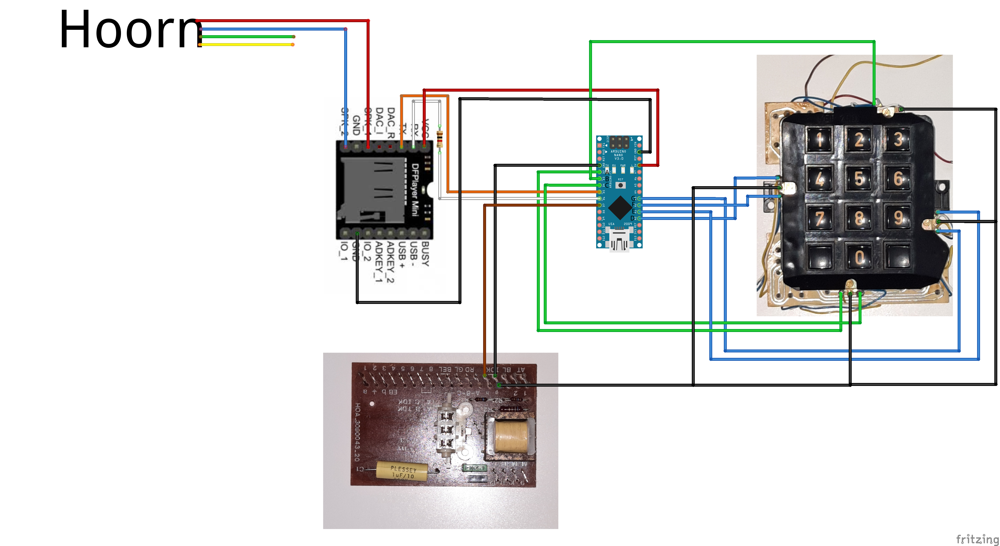

This is an Arduino project to transform an old [POTS](https://en.wikipedia.org/wiki/Plain_old_telephone_service) (Plain Old Telephone Service) button phone into an escape room prop or puzzle. This project allows audio files to play when a user dials a pre-programmed phone number, and provides audio feedback for tones dialed.

This project requires significantly changing the internal wiring of the phone, meaning it can no longer be used for normal operation unless restored to its original state.

If you are looking for an Arduino project with an old rotary phone, consider one of these resources instead:
* [Arduino-Controlled Rotary Telephone (DIY Escape Room Prop Tutorial) (Youtube)](https://www.youtube.com/watch?v=cZ2rHqBXO1s&t=2237s)
* [Reading Old Rotary Phone Dial With Arduino (YouTube)](https://www.youtube.com/watch?v=x6QlOP-AZII)

If you are instead looking for existing solutions to just plug your old phone into, consider setting up an [Asterisk](https://www.asterisk.org/) server, and connecting your phone using an appropriate POTS to IPPhone interface. See e.g., https://www.outsideopen.com/rotary-phone-asterisk/ for ideas.

# Features
This phone project was developed for a Dutch game in the theme of [La Casa de Papel](https://en.wikipedia.org/wiki/Money_Heist) by [Escape Room Time](https://escaperoomtime.nl) (book this game [here](https://escaperoomtime.nl/activiteiten/vr-escape-game-la-casa-de-papel/)). For this reason, the provided audio files are mainly Dutch.

The game requires the user to call *El Professor* by dialing a phone number found in another puzzle (the actual phone number and puzzle solution is not included in this repository), after which an audio file will be played over the speaker in the horn with the code to solve the next puzzle. One of the digits of this phone number is found in a fourth puzzle. If the user guesses this digit incorrectly instead of solving the fourth puzzle, a red herring audio file is played, which is a robot menu with hold music.

Phone numbers can easily be added and associated with audio files to play by adding an entry to the array in [`phone-numbers.h`](arduino-code/phone-numbers-example.h). Placeholder digits can be included in any phone number to match with any key pressed by the user. Instructions for changing or adding phone numbers are embedded in the code file.

Audio feedback is provided to the user as they interact with the phone (including waiting tone, dialing tone, and [DTMF](https://en.wikipedia.org/wiki/Dual-tone_multi-frequency_signaling) (dual-tone multi-frequency) tones when pressing a button. All these tones are modeled after the [Dutch telephone network specification](https://nl.wikipedia.org/wiki/Telefoontonen).

Calling 0800-VOLUME allows changing the output volume of the speaker embedded in the horn (NOTE: This change is lost after reboot, e.g., due to power loss).

A loud 1.5 seconds tone is played on startup to indicate normal operation. If this tone is not heard, it may be possible the MP3 player is not wired correctly to the Arduino, or the SD card has become dislodged.

# Hardware
* **Old Phone**: For this project, a [PTT Unifoon TDK Stockholm](https://dutchtelephones.com/unifoon/) was selected for its resemblance to the phone used by El Professor in [La Casa de Papel](https://en.wikipedia.org/wiki/Money_Heist). This hardware has the additional advantage of having plenty of working space within the body, and non-soldered wiring of the main components to the board. Both [IDK](https://en.wikipedia.org/wiki/Pulse_dialing) (Impulse Dialing) and [TDK](https://en.wikipedia.org/wiki/Dual-tone_multi-frequency_signaling) (Tone Dialing) versions are supported.
* **Arduino**: For this project, an [Arduino Nano](https://store.arduino.cc/products/arduino-nano) was used, as its small profile allows it to be placed within the phone, minimizing the need for extra cabling
* [**DF Player Mini**](https://wiki.dfrobot.com/DFPlayer_Mini_SKU_DFR0299#Connection_Diagram): Note that micro SD cards are supported up to 32GB in size

# Getting started
To make use of this project, some custom wiring is required. To embed both the Arduino and DF Player Mini in the phone itself, soldering is probably required due to space constraints, but if you do not mind running more wires to outside the phone, perhaps common Dupont cables can be used with a larger Arduino.

The DF player mini is wired directly to the phone's speaker embedded in the horn, so no additional speaker is required.

## Arduino code
The Arduino code is located in the [`arduino-code`](arduino-code), with the file [`arduino-code.ino`](arduino-code/arduino-code.ino) being the main code file.
This file imports 4 other files, which contain the variables that you are most likely to want to change:

* [**connections.h**](arduino-code/connections-example.h): If you change the wiring compared to the diagram below, update the Arduino pins in this file
* [**phone-numbers.h**](arduino-code/phone-numbers-example.h): Here you can change (and find instructions for changing) the phone numbers that are used in the puzzle
* [**sound-files.h**](arduino-code/sound-files-example.h): All the audio files that can be played by the puzzle. Note that the DF Player Mini uses (1-based) indices and not file names.
* [**variables.h**](arduino-code/variables-example.h): Miscelanious variables. Enable/disable things such as debug mode and phone wiring mode here

The above four files provided are *examples*. **Rename those files** by removing the `-example` part from the file name for each of those files, or the Arduino code will not compile.

The code depends on the [SoftwareSerial](https://www.arduino.cc/en/Reference/softwareSerial) and [DFPlayerMini_Fast](https://github.com/PowerBroker2/DFPlayerMini_Fast) Arduino libraries. Both can be installed from the Arduino IDE by going to `Tools` -> `Manage Libraries..`.

## Wiring
The Arduino needs to be wired to the phone and to the DF Player Mini according to the following diagram:



The letters for the connection come from the attached PCB. Note that on the image, the Unifoon has a PCB soldered to the keyboard which needs to be removed.

Inputs can be changed (even the buttons wired to analog pins are only read digitally), in which case the (`connections.h`)[arduino-code/connections-example.h] file needs to be updated. Be mindful of which rows/columns each of the letters A-G correspond to.

### Using a different phone
The diagram provided is specific to the PTT Unifoon. However, due to having to be compatible with the network, the components and wiring between them has been standardized for many phones (a great resource in Dutch detailing the inner workings of these types of phones can be found [here](http://www.johngeus.dds.nl/TelExpln.html)). Although not guaranteed, it is very likely many old POTS phones with button keyboards will work. However, it may be necessary to be creative to read the on-hook state of the phone.

A diagram of the original wiring before modification of the PTT Unifoon [is provided](wiring/original-uniphone.png) to help you understand the changes that were made. This could be useful in understanding how different phones should be wired.

## Audio
Copy all the files from the *sd-card* directory to a micro SD card (with a maximum size of 32GB). Replace the file `019-puzzle-solved.wav` with a WAV or MP3 file with your puzzle solution, and update the duration of this audio file in the Arduino code. Update the phone number for the puzzle solution accordingly.

Be aware that some computer systems will add additional files to the SD card on mounting. Make sure to show hidden files and folders on your machine, and ensure no additional files are added to the SD cards root or any of its directories. Finally, place the SD card into the micro SD card slot on the DF Player Mini.

You can add additional files and associate them with a new phone number in [`phone-numbers.h`](arduino-code/phone-numbers-example.h) by refering to them by their (1-based) index on the SD card. Optionally add a reference to the audio file in [`sound-files.h`](arduino-code/sound-files-example.h).

# Details & Quircks

### Debug mode
By default, the code writes debug statements to the serial monitor (BAUD 115200) to monitor the behavior. For efficiency reasons, it is best to comment out the `#DEFINE DEBUG` line in [`variables.h`](arduino-code/variables-example.h) when deployed to production. This enables a mode where no serial connection is opened via USB, and no debug statements are written.

### DTMF tones
The DF Player Mini is a great MP3 player for Arduino projects, but instructions are send over a serial connection and not interpreted instantly. The original intention was to play the DTMF tones immediately and for as long as the button was pressed. However, on quick succesive button pressed signals to the MP3 player could be lost. Instead, the code maintains a *cache* of sorts of numbers pressed for which it needs to play audio, and all button press feedback is fixed in length. If the user dials a number quickly, button feedback will be slightly delayed for this reason. An implementation using the GPIO pins of a Raspberry Pi is likely to get better results, but at higher costs.

### Multiple input mappings
The code has been used to transform two phones into escape room props, with slightly different wiring to the inputs on the Arduino. The code can operate in one of two modes associated with the different wiring. If the wiring of the diagram above is followed, ensure the mode `ESCAPE_ROOM_TIME` is enabled in [`variables.h`](arduino-code/variables-example.h), by uncommenting that line, and commenting the line defining `PORTABLE_GAME`:

```arduino
/* 
 * Different wiring schemes exist for different versions of the phone.  
 * Exactly one of the two following needs to be uncommented
 */
#define ESCAPE_ROOM_TIME // Uncomment this line for the wiring of the phone that is not portable
//#define PORTABLE_GAME // Uncomment this line for the portable phone wiring
```


# Credit and License
The code can be freely used under the Mozilla Public License 2.0. See the [license file](LICENSE) for details.

Spoken numbers downloaded from https://evolution.voxeo.com/library/audio/prompts/ (LGPL opensource license)
Robotic voice messages generated using https://ttsmp3.com/


